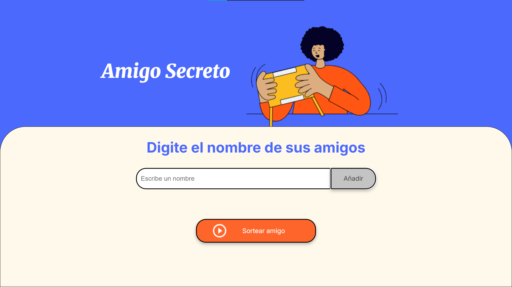
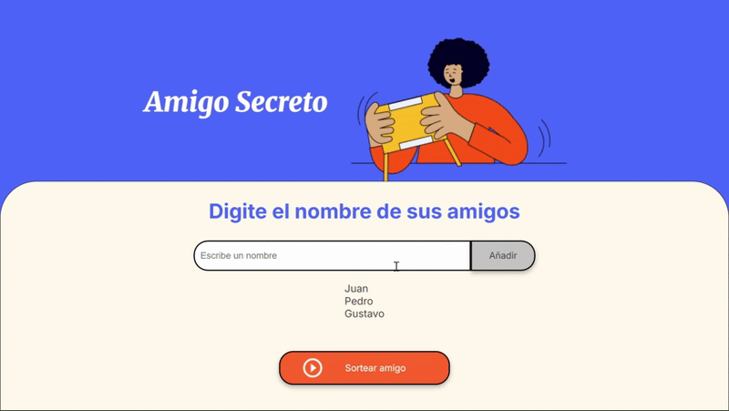
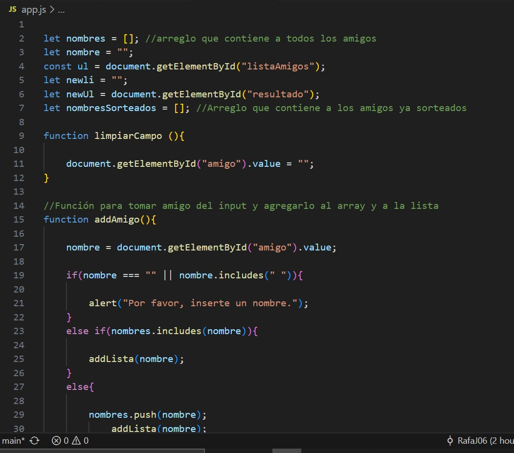

# Challenge-Amigo-Secreto
     
 This is the first challenge for the __group G9 from Alura + Oracle__ formation.

## Description  

 The project is based on the game "Secret Santa" *("amigo secreto" en español o **(en el caso de República Dominicana)** "angelito")*. 

## How to Play

You need to add names in the input block **(one by one and sending it with the button "Añadir")**. When you finished of adding all your friends, then just click on "Sortear amigo". Now you can see who your secret friend is! __(Think of a good present for him!)__

## Deleating a name

If you want to delete a name from the list just click on it!

## Hiding a sorted friend
To hide a friend that was sort just click on it **(remember to do it before another friend looks who you had!) **

# About the code

The code is structure using functions and has comments (in spanish) to explain what are suppose to do all those functions. 

 ## Example 

